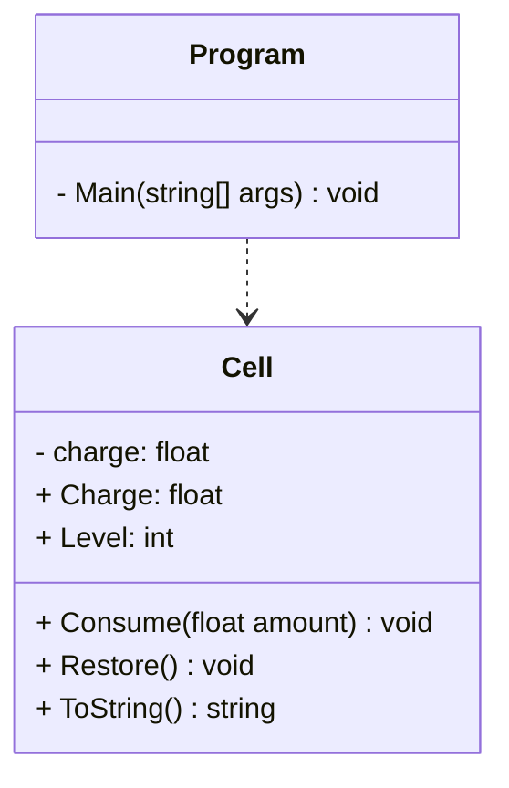

```mermaid
classDiagram

    class Cell{
     - charge: float
     + Charge: float
     + Level: int

     

     + Consume(float amount) void
     + Restore() void
     + ToString() string

    }

    class Program{
        - Main(string[] args) void

    }

    Program ..> Cell
```